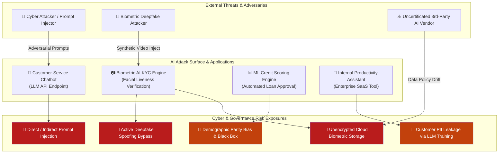

# 🤖 Enterprise AI Governance & Third-Party Risk Management (TPRM) Framework


**Client:** SecureBank Digital Services Pvt. Ltd. (Hypothetical Indian BFSI Entity)  
**Scope:** AI Systems Lifecycle, Algorithmic Risk Classification, Weighted Vendor Scoring & Third-Party Oversight  
**Target Roles:** Cybersecurity GRC Consultant, AI Risk & Governance Specialist, TPRM Analyst  

---

> [!NOTE]  
> **Portfolio Disclaimer:** SecureBank Digital Services Pvt. Ltd. is a fictional entity created for cybersecurity & AI risk consulting portfolio demonstration. All use cases, vendor assessments, scoring metrics, and governance rules represent hypothetical consulting assumptions created to demonstrate real-world GRC thought leadership.

---

## 📑 Table of Contents
- [Executive Overview](#-executive-overview)
- [AI Threat Architecture & Attack Vectors](#-ai-threat-architecture--attack-vectors)
- [AI Risk Classification Tiers & Governance Rules](#-ai-risk-classification-tiers--governance-rules)
- [Weighted TPRM Vendor Scoring Model](#-weighted-tprm-vendor-scoring-model)
- [Vendor Risk Scorecard Results](#-vendor-risk-scorecard-results)
- [10-Stage AI Lifecycle Stage-Gates](#-10-stage-ai-lifecycle-stage-gates)
- [Interactive AI & TPRM Executive Dashboard](#-interactive-ai--tprm-executive-dashboard)
- [Repository Structure & Deliverables](#-repository-structure--deliverables)

---

## 👔 Executive Overview

As **SecureBank Digital Services Pvt. Ltd.** accelerates its digital banking operations, the organization is deploying Artificial Intelligence (AI) and Machine Learning (ML) across six key financial workflows: **Customer Support Chatbots, Transaction Fraud Detection, Algorithmic Credit Risk Assessment, Document OCR/NLP Processing, Employee HR Assistants, and Biometric Customer Onboarding (KYC)**.

While AI adoption enhances operational velocity, it introduces non-traditional cyber threat vectors—including **adversarial prompt injection, algorithmic bias, black-box explainability failures, model concept drift, customer PII data leakage via cloud LLM APIs, and third-party AI supply chain dependencies**.

This repository delivers an **Enterprise AI Governance & Third-Party Risk Management (TPRM) Framework** designed to ensure responsible, secure, and compliant AI deployment in strict alignment with **RBI Guidelines**, **ISO/IEC 42001 (AI Management System)**, **NIST AI RMF 1.0**, and India's **Digital Personal Data Protection (DPDP) Act 2023**.

---

## ⚡ AI Threat Architecture & Attack Vectors



---

## 🎯 AI Risk Classification Tiers & Governance Rules

SecureBank categorizes AI initiatives into three distinct risk tiers, each enforcing technical controls and multi-tier approval authorities:

```
+--------------------------------------------------------------------------------------------------------+
|                                    AI RISK CLASSIFICATION TIERS                                        |
+--------------------------------------------------------------------------------------------------------+
|  TIER 3: HIGH RISK      | 3 Initiatives (50%) | Credit Risk Scoring, Fraud Detection, Biometric AI KYC  |
|                         | Governance: Board Risk Committee & AI Governance Committee approval.             |
|                         | Technical Controls: Mandatory demographic bias audit, SHAP, active 3D liveness.|
+-------------------------+------------------------------------------------------------------------------+
|  TIER 2: MEDIUM RISK    | 2 Initiatives (33%) | Customer Support Chatbot, Document Processing (OCR)      |
|                         | Governance: Business AI Owner & CISO / Risk Lead approval.                    |
|                         | Technical Controls: NeMo prompt injection guardrails, OCR thresholding (>95%).|
+-------------------------+------------------------------------------------------------------------------+
|  TIER 1: LOW RISK       | 1 Initiative (17%)  | Employee HR Productivity Assistant                       |
|                         | Governance: Business AI Owner & HR Lead sign-off.                             |
|                         | Technical Controls: Zero-data-retention enterprise API endpoints, DLP rules.   |
+--------------------------------------------------------------------------------------------------------+
```

---

## 📐 Weighted TPRM Vendor Scoring Model

Third-party vendor risk posture is calculated across **six weighted operational domains**:

$$\text{Overall Vendor Score} = (0.25 \times \text{InfoSec}) + (0.20 \times \text{Privacy}) + (0.20 \times \text{AI Governance}) + (0.15 \times \text{BCP}) + (0.10 \times \text{Compliance}) + (0.10 \times \text{Incident Mgmt})$$

- 🟢 **Low Risk (Score ≥ 80%):** Standard due diligence & annual SOC 2 review.
- 🟡 **Medium Risk (Score 60%–79%):** Enhanced due diligence & bi-annual penetration test audit.
- 🔴 **High Risk (Score < 60%):** Senior Management sign-off, quarterly re-assessments & conditional onboarding freeze.

---

## 📊 Vendor Risk Scorecard Results

Comprehensive security and governance evaluation of SecureBank's six core technology suppliers:

```
========================================================================================================
Vendor ID | Vendor Name                   | Service Provided              | Overall Score | Risk Rating
--------------------------------------------------------------------------------------------------------
VND-001   | CloudScale Solutions Ltd.     | Cloud Hosting Infrastructure  |     90.0%     | 🟢 Low Risk
VND-006   | OfficeCloud SaaS Corp         | Employee Productivity SaaS    |     86.7%     | 🟢 Low Risk
VND-004   | OmniChat AI Platforms         | Customer Support Chatbot      |     74.7%     | 🟡 Medium Risk
VND-002   | FinTech Pay Gateway Services | Payment Gateway & UPI API     |     73.2%     | 🟡 Medium Risk
VND-005   | AnalyticsCore AI Solutions   | Credit Risk & Fraud Engine    |     63.1%     | 🟡 Medium Risk
VND-003   | SmartKYC Verification Systems | Biometric AI & Optical KYC    |     56.9%     | 🔴 HIGH RISK
========================================================================================================
```

### Critical Finding: High-Risk Vendor (`SmartKYC Verification Systems`)
- **Overall Score:** **56.9%** (Fails mandatory 60% threshold).
- **Core Deficiencies:** Unencrypted biometric audit logs in cloud storage, missing SOC 2 Type II certification, unvetted 4th-party offshore subcontractors, lack of ISO 30107-3 deepfake liveness testing.
- **Required Treatment:** Freeze new customer onboarding via SmartKYC until vendor implements AES-256 cloud encryption and completes an independent SOC 2 Type II audit within 60 days.

---

## 🔄 10-Stage AI Lifecycle Stage-Gates

```
[1] Use Case Identification  -->  [2] Risk Classification  -->  [3] Data Assessment
                                                                       |
[6] Governance Approval      <--  [5] Vendor/Model Review   <--  [4] Security Assessment
         |
         v
[7] Staging & Implementation -->  [8] Continuous Monitoring -->  [9] Periodic Review  --> [10] Retirement
```

Every AI initiative must pass mandatory stage-gate approvals in Jira Service Management before code deployment.

---

## 💻 Interactive AI & TPRM Executive Dashboard

The repository includes a fully self-contained HTML executive dashboard designed for board reporting:

- **Location:** [`dashboard/index.html`](file:///Users/krishnarawat/Desktop/GRC_1/project-2-ai-governance-tprm/dashboard/index.html)
- **Features:** 
  - Executive KPI summary cards (AI Tiers, Vendor Risk Distribution, High Risk Count).
  - Interactive Chart.js analytics (AI Tier Donut, Vendor Rating Bar, AI Category Breakdown).
  - Multi-tab navigation (AI Use Cases, AI Risk Register, Vendor Scoring, Vendor Risk Register).
  - Responsive dark-slate BFSI consulting UI aesthetics.

---

## 📁 Repository Structure & Deliverables

- 📄 [`docs/executive-summary.md`](file:///Users/krishnarawat/Desktop/GRC_1/project-2-ai-governance-tprm/docs/executive-summary.md) — Executive C-level briefing.
- 📄 [`docs/ai-governance-framework.md`](file:///Users/krishnarawat/Desktop/GRC_1/project-2-ai-governance-tprm/docs/ai-governance-framework.md) — Full AI risk classification & 10-stage lifecycle guide.
- 📄 [`docs/tprm-framework.md`](file:///Users/krishnarawat/Desktop/GRC_1/project-2-ai-governance-tprm/docs/tprm-framework.md) — 6-domain weighted vendor scoring methodology.
- 📄 [`docs/management-recommendations.md`](file:///Users/krishnarawat/Desktop/GRC_1/project-2-ai-governance-tprm/docs/management-recommendations.md) — Prioritized 180-day remediation roadmap.
- 📊 [`data/ai-use-cases.csv`](file:///Users/krishnarawat/Desktop/GRC_1/project-2-ai-governance-tprm/data/ai-use-cases.csv) — 6 BFSI AI use cases mapped to risk tiers.
- 📊 [`data/ai-risk-register.csv`](file:///Users/krishnarawat/Desktop/GRC_1/project-2-ai-governance-tprm/data/ai-risk-register.csv) — 12 identified AI risks across 11 categories.
- 📊 [`data/vendor-assessment.csv`](file:///Users/krishnarawat/Desktop/GRC_1/project-2-ai-governance-tprm/data/vendor-assessment.csv) — 6 evaluated technology/AI suppliers.
- 📊 [`data/vendor-risk-register.csv`](file:///Users/krishnarawat/Desktop/GRC_1/project-2-ai-governance-tprm/data/vendor-risk-register.csv) — 10 third-party supplier risks.
- 📊 [`templates/vendor-questionnaire.csv`](file:///Users/krishnarawat/Desktop/GRC_1/project-2-ai-governance-tprm/templates/vendor-questionnaire.csv) — 25-question vendor assessment questionnaire.
- 🖥️ [`dashboard/index.html`](file:///Users/krishnarawat/Desktop/GRC_1/project-2-ai-governance-tprm/dashboard/index.html) — Interactive executive HTML dashboard.
- 🎤 [`presentation/presentation-outline.md`](file:///Users/krishnarawat/Desktop/GRC_1/project-2-ai-governance-tprm/presentation/presentation-outline.md) — 10-slide executive presentation outline.
